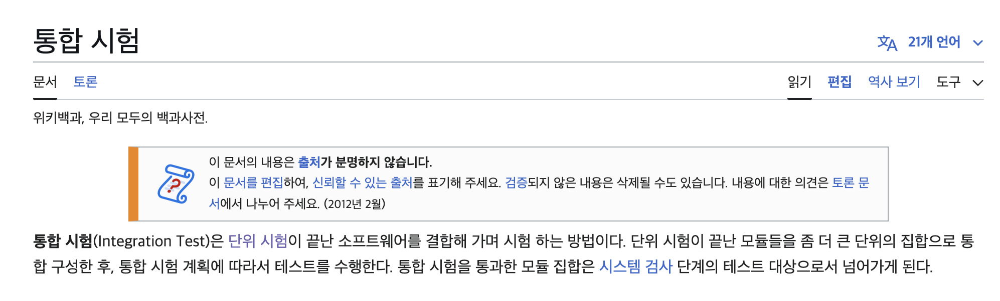
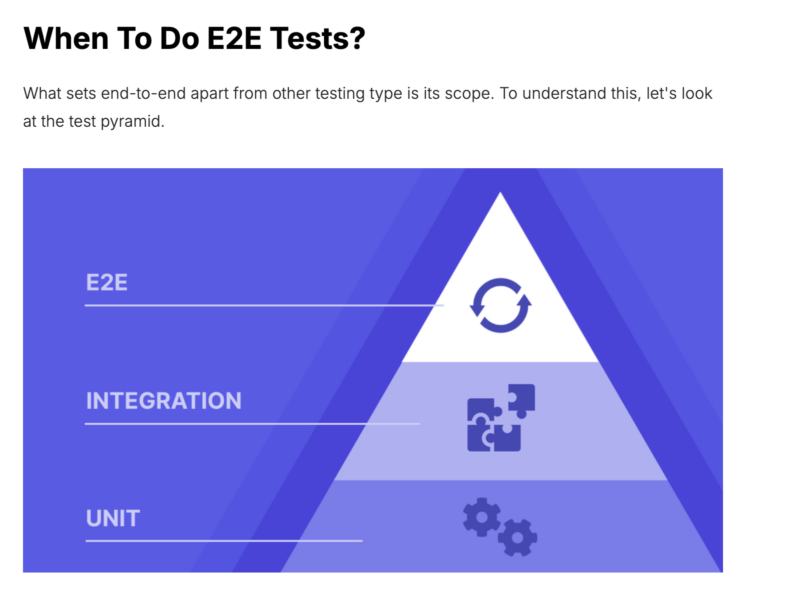
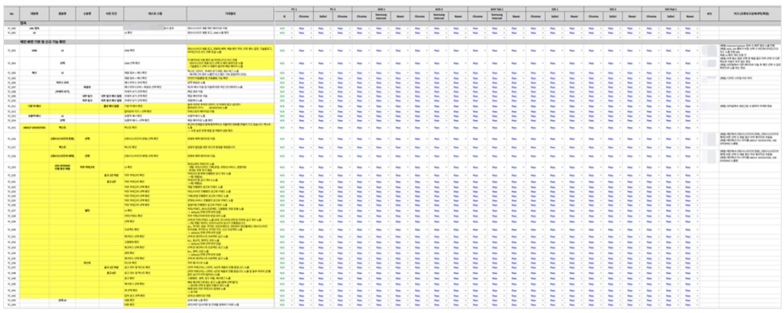
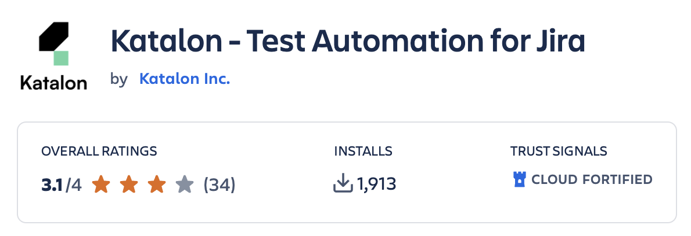
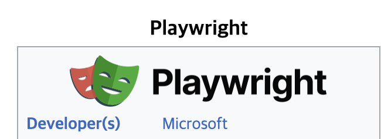

# docker-playwright-e2e-test

**Playwright, TypeScript, AllureReport**를 사용하여 E2E(End-to-End) 테스트를 자동화합니다.  
서비스에 E2E 테스트를 도입해보세요.

## 목차

[사용법](#사용법)  
[주요 명령어](#주요-명령어)  
[프로젝트 구조](#프로젝트-구조)  
[about e2e test](#about-e2e-test)  
&nbsp;&nbsp;&nbsp;[단위 테스트 (Unit Test)](#단위-테스트-unit-test)  
&nbsp;&nbsp;&nbsp;[통합 테스트 (Integration Test)](#통합-테스트-integration-test)  
&nbsp;&nbsp;&nbsp;[E2E (End-To-End) Test](#E2E-테스트)  
&nbsp;&nbsp;&nbsp;[E2E 테스트 툴 선정 기준](#e2e-테스트-툴-선정-기준)  
&nbsp;&nbsp;&nbsp;[화면 테스트 툴 비교](#화면-테스트-툴-비교)  
&nbsp;&nbsp;&nbsp;[셀레니움 (Selenium)](#셀레니움-selenium)  
&nbsp;&nbsp;&nbsp;[플레이라이트 (Playwright)](#플레이라이트-playwright)  
&nbsp;&nbsp;&nbsp;[ref](#ref)

<br>

## **사용법**

```bash
1. docker-compose up --build

2. visit localhost:9322
```

<br>

## **주요 명령어**

| 명령어                                  | 설명                   |
|--------------------------------------|----------------------|
| `yarn start`                         | 모든 과정 실행             |
| `yarn test`                          | 모든 테스트 실행            |
| `yarn playwright test <file>`        | 특정 테스트 파일 실행         |
| `yarn allure`                        | 테스트 메인 페이지 실행        |
| `yarn show-report`                   | 테스트 상세 페이지 실행        |
| `yarn test-ui`                       | 테스트 실행 페이지 실행        |
| `yarn playwright test --headed`      | 브라우저를 띄운 상태에서 테스트 실행 |
| `yarn playwright test --slow-mo=500` | 테스트 실행 속도를 느리게 설정    |
| `yarn playwright codegen`            | 테스트 코드 자동 생성 (화면 녹화) |

<br>

## **프로젝트 구조**

```plaintext
📂 e2e-test
│
├── 📂 config            # config 폴더
├── 📂 tests             # 테스트 폴더
│   └── demo-todo-app.spec.ts  # 테스트 예제 파일
```

<br>

# about e2e test

e2e test 를 다루기 전에 단위 테스트, 통합 테스트를 간단하게 알아보자.

<br>

## 단위 테스트 Unit test

단위 테스트, 유닛 테스트는 소스 코드의 특정 모듈이 의도된 대로 정확히 작동하는지 검증하는 절차다.

<br>

예시를 통해 알아보자.

<br>

**Calculator.java**

```java
public class Calculator {
    public int add(int a, int b) {
        return a + b;
    }
}
```

<br>

`Calculator` 클래스에 `add` 메서드를 테스트한다고 가정한다.

<br>


**CalculatorTest.java**

```java
class CalculatorTest {

    @Test
    void testAdd() {
        // arrange
        Calculator calculator = new Calculator();
        
        // act
        int result = calculator.add(2, 3);
        
        // assert
        assertEquals(5, result);
    }
}
```
<br>

arrange: Calculator 객체를 생성한다.

act: add 메서드를 실행한다.

assert: 기댓값과 결과를 검증한다.

<br>

모듈이 의존성을 가지는 경우, 의존하는 모듈을 Mock 객체로 만들어 특정 행동 및 결과값이 나오도록 정의한 후 단위 테스트 한다.

<br>

```java
class UserServiceTest {

    @Mock
    private UserRepository userRepository;

    @InjectMocks
    private UserService userService;

    @Test
    void testGetUserNameById_Success() {
        // Arrange
        Long userId = 1L;
        User user = new User(userId, "foo");
        when(userRepository.findById(userId)).thenReturn(Optional.of(user));

        // Act
        String userName = userService.getUserNameById(userId);

        // Assert
        assertEquals("foo", userName);
    }
```
<br>

## 통합 테스트 Integration Test



<br>

요약하자면 통합 테스트는 단위 테스트보다 더 큰 동작을 달성하기 위해 여러 모듈들을 모아 이들이 의도대로 협력하는지 확인하는 테스트이다.

<br>

`@SpringBootTest` 어노테이션은 모든 모듈이 올바르게 초기화되는지 확인하는 과정으로, 통합 테스트의 성격을 갖는다.

```java
@SpringBootTest
class SpringApplicationTests {

		...
}
```

<br>

## E2E 테스트



<br>

E2E Test는 End-To-End의 약자인 종단(Endpoint) 간 테스트로 사용자의 입장에서 테스트를 말한다.

<br>

보통 단위, 통합 테스트 이후에 진행하게 되며, Web, App 등에서 GUI를 통해서 시나리오, 기능 테스트 등을 수행한다.

<br>

단위, 통합 테스트로도 백엔드, 프론트 모듈의 무결성을 증명할 수 있지만 실제 애플리케이션의 동작, 시나리오 무결성은 보장할 수 없다.  이 테스트를 통과함으로써 **애플리케이션의 무결성**을 증명할 수 있게 된다.

<br>

위의 그림을 보면 피라미드 형태로 되어있는데 단계별 테스트의 비중과 비용에 대해 E2E 테스트 10%, 통합 테스트 30%, 유닛 테스트 60% 와 같이 비중을 조절해야 한다는 의미이다.

<br>

E2E 테스트는 비용이 많이 드는 만큼 꼭 필요한 테스트만 수행하자.

<br>

Java에서는 레스트 어슈어드(`RestAssured`) 를 활용하여 E2E 테스트를 할 수 있다.

<br>

`MockMvc`는 컨트롤러와 서비스 계층의 연동으로 E2E 테스트가 아니라 통합 테스트에 더 가깝다.

<br>


```java
@Test
public void testGetUser() {

    RestAssured.baseURI = "http://localhost:8080";

    given()
        .header("Content-Type", "application/json")
        .when()
        .get("/api/users/1")
        .then()
        .statusCode(200)
        .body("id", equalTo(1))
        .body("name", notNullValue());
}
```

<br>

레스트 어슈어드(`RestAssured`)를 사용해 E2E 테스트를 진행할 수 있지만, 위 예시처럼 API 테스트에 초점이 맞춰져 있고 E2E 테스트 전 범위를 커버하는 데 한계가 있다.

<br>

진정한 의미의 E2E 테스트는 API 호출뿐만 아니라, 프론트와 백엔드를 포함한 전체 시스템의 동작을 검증해야 한다.

<br>

이를 보완할 수 있는 툴을 찾아 적용해 보자.

<br>

### E2E 테스트 툴 선정 기준

- 테스트 작성의 편리함
- 오픈소스 기반 (오픈소스는 사용자가 많을수록 업데이트가 빠르며, 무료라는 장점이 있다.)
- 강력한 문서화(엑셀로 모든 UI, 케이스를 다룰수 있지만 프로젝트가 클수록 방대해지고, 특정 UI를 찾기 힘들며, 문서 작성의 시간이 고되다)

  

<br>


### 화면 테스트 툴 비교

**카탈론(Katalon)**



<br>

테스트 영상

https://github.com/user-attachments/assets/f85771fa-9b47-44e7-a7fe-a2c02d63fd56

<br>

**장점**

- 웹에서의 행동을 녹화하여 케이스들을 관리할수 있으며, 코드를 크게 사용하지 않고 테스트가 가능함.
- 깃(Git)으로 관리가 가능하며, Atlassian JIRA 연동, API 테스트, BDD(Given-When-Then) 테스트, Junit 연동, 웹, 모바일 환경 전부 테스트 가능함.
- 무료 버전으로도 해당 기능들이 사용 가능함.

<br>

**단점**

- 사용법이 다소 어려움.
- 무료 버전이 언제 유료가 될지 모름.

<br>

### 셀레니움 Selenium


<br>

테스트 영상

https://github.com/user-attachments/assets/7fbe9a97-621c-4104-881f-7a10c669826c

<br>

**장점**

- 가장 널리 사용되는 E2E(End-To-End) 테스트 자동화 툴
- 크롬, 사파리 확장 프로그램으로 IDE 사용 가능하며, IDE로 행동 녹화, 재생, test code 추출 기능 제공


- Java Junit으로 테스트가 가능함.
- 카탈론보다 비교적 쉬움.

<br>

**단점**

- 테스트가 많아질수록 느림. (병렬 실행 X)
- 웹 로딩 수동 대기 필요.
- 문서화 기능이 없음.

<br>

### 플레이라이트 Playwright



<br>

테스트 영상

같은 테스트를 chrome, firefox 환경에서 실행하는 예시

https://github.com/user-attachments/assets/5cbead30-dea1-4e5d-a5e9-cc8935ae6239

<br>

**장점**

- 빠름 (병렬 실행 O)
- 셀레니움에서 제공하는 기능들 모두 제공
- 강력한 문서화

https://github.com/user-attachments/assets/e8085ea7-3084-4937-a283-2f6606520dba

<br>

문서에 스크린샷, 동영상 첨부, 테스트 실행환경(API HTTP Network 흐름)까지 자세하게 볼 수 있다.

(단, 플레이라이트(Playwright)를 자바 환경이 아닌 Node.js 서버로 구동해야한다.)

<br>

**단점**

- 사용법이 다소 어려움.
- 문서화 기능이 있지만 관리하기엔 불편하다. (얼루어(Allure)와 통합하여 사용하자)

https://github.com/user-attachments/assets/3d8acf35-aa7f-40c2-884f-dfd4a7be80bf

<br>

## ref

[https://katalon.com/resources-center/blog/end-to-end-e2e-testing](https://katalon.com/resources-center/blog/end-to-end-e2e-testing)
